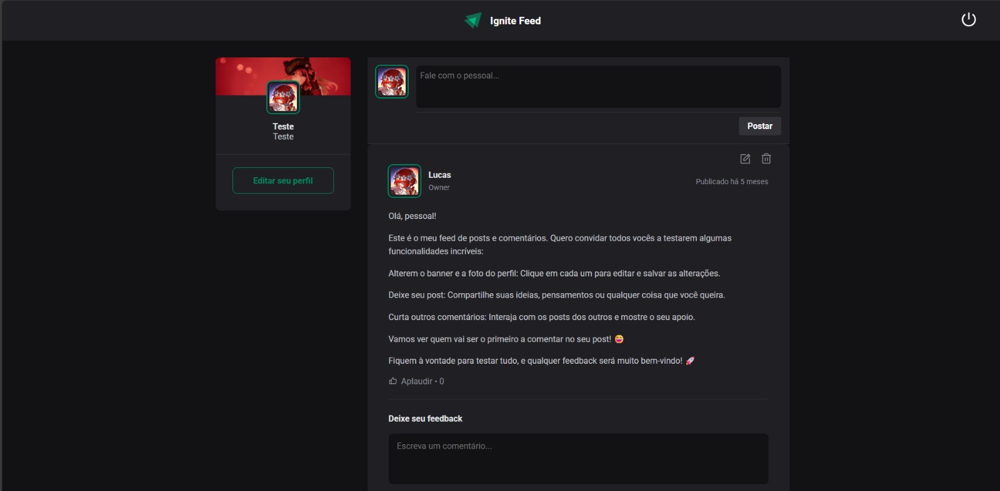

# Ignite Feed 🚀

  

## 💻 Projeto

O Ignite Feed é uma aplicação fullstack que simula uma rede social moderna, onde os usuários podem compartilhar posts e interagir através de comentários. O projeto foi inicialmente desenvolvido durante o bootcamp Ignite da Rocketseat, onde foi criada a interface do feed. A partir dessa base, implementei toda a parte de autenticação no frontend e desenvolvi o backend completo da aplicação.

  
  

## ✨ Features

- **Autenticação Completa**
  - Login com JWT
  - Registro de novos usuários
  - Proteção de rotas
- **Gestão de Usuários**

  - Upload de avatar
  - Personalização de perfil
  - Diferentes níveis de permissão

- **Interação Social**
  - Criação de posts
  - Sistema de comentários
  - Feed dinâmico
  - Likes em posts

## 🛠️ Tecnologias

### Backend

- [Node.js](https://nodejs.org/)
- [Express](https://expressjs.com/)
- [SQLite](https://www.sqlite.org/)
- [Knex.js](http://knexjs.org/)
- [JWT](https://jwt.io/) para autenticação
- [Multer](https://github.com/expressjs/multer) para upload de arquivos
- [Bcrypt](https://github.com/kelektiv/node.bcrypt.js) para criptografia

### Frontend

- [React](https://reactjs.org/)
- [Vite](https://vitejs.dev/)
- [Axios](https://axios-http.com/)
- [React Router DOM](https://reactrouter.com/)
- [CSS Modules](https://github.com/css-modules/css-modules)

## 🚀 Como executar

### Pré-requisitos

- Node.js
- NPM ou Yarn

### Clonando o repositório

\`\`\`bash
git clone https://github.com/keewonf/FeedFront.git
cd FeedFront
\`\`\`

### Configurando o Backend

1. Navegue até a pasta do backend
   \`\`\`bash
   cd backend
   \`\`\`

2. Instale as dependências
   \`\`\`bash
   npm install
   \`\`\`

3. Crie o arquivo .env baseado no exemplo
   \`\`\`bash
   cp .env.example .env
   \`\`\`

4. Configure as variáveis de ambiente no arquivo .env
   \`\`\`properties
   AUTH_SECRET=seu_jwt_secret_aqui
   JWT_EXPIRES_IN=1d
   PORT=3333
   \`\`\`

5. Execute as migrations
   \`\`\`bash
   npm run migrate
   \`\`\`

6. Inicie o servidor
   \`\`\`bash
   npm run dev
   \`\`\`

### Configurando o Frontend

1. Navegue até a pasta do frontend
   \`\`\`bash
   cd frontend
   \`\`\`

2. Instale as dependências
   \`\`\`bash
   npm install
   \`\`\`

3. Configure o arquivo .env
   \`\`\`properties
   VITE_API_URL=http://localhost:3333
   \`\`\`

4. Inicie a aplicação
   \`\`\`bash
   npm run dev
   \`\`\`

## 📱 Funcionalidades Implementadas

- Sistema completo de autenticação
- CRUD de posts
- Sistema de comentários
- Upload de imagens
- Proteção de rotas
- Diferentes níveis de acesso
- Interface responsiva
- Feedback visual de ações
- Tratamento de erros

## 🎨 Layout

O layout da página do feed foi desenvolvido pela [Rocketseat](https://www.rocketseat.com.br/) durante o bootcamp Ignite. A partir dessa base, desenvolvi as interfaces de login e registro, mantendo a mesma identidade visual e padrões de design.

## 🤝 Contribuições

Este projeto é open source e está aberto a contribuições. Sinta-se à vontade para:

- 🐛 Reportar bugs
- 💡 Sugerir novas features
- 🔧 Enviar pull requests

## 📝 Licença

Este projeto está sob a licença MIT. Veja o arquivo [LICENSE](LICENSE.md) para mais detalhes.

## 💜 Agradecimentos

- [Rocketseat](https://www.rocketseat.com.br/) pelo design inicial do feed e pelos ensinamentos durante o bootcamp
- Todos que de alguma forma contribuíram para o projeto

---

Desenvolvido com 💜 por Keewon Floriano

